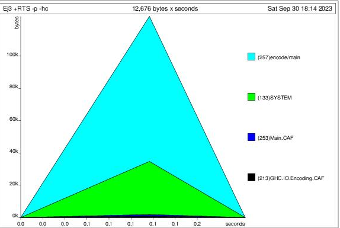
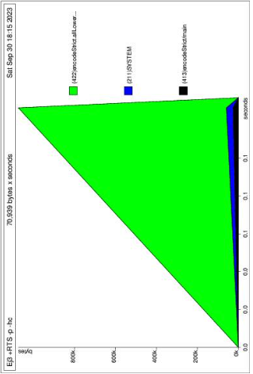
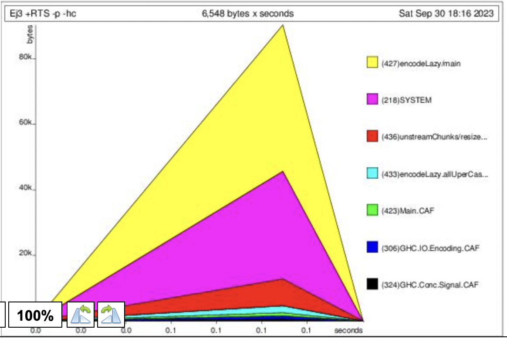

# Aviso:

Los archivos ejecutables y los encoding del texto son dejados afuera de la entrega dado que los tamaños de los mismos sobrepasan el tamaño máximo del archivo a entregar, si se desea compilar y ejecutar se deberá copiar el archivo `el_quijote.txt` en la carpeta correspondiente a ejecutar.

# Resultados del profiling:

Al realizar el heap profiling de las distintas versiones del programa obtuvimos los siguientes resultados. Para estas pruebas se utilizo el archivo de texto `el_quijote.txt` provisto en el EVA.

## Operaciones Lista

Los resultados del heap profiling para la version implementada con operaciones de lista fue:

```
total time  =        0.17 secs   (169 ticks @ 1000 us, 1 processor)
total alloc = 507,293,392 bytes  (excludes profiling overheads)

COST CENTRE            MODULE SRC                    %time %alloc

encode.allLowerCase    Main   Ej3.hs:19:7-42          40.2   20.8
encode.allUperCase     Main   Ej3.hs:17:7-41          19.5   20.8
encode                 Main   Ej3.hs:(12,1)-(20,35)   14.2    8.3
hashIt                 Main   Ej3.hs:(22,1)-(24,45)   11.2   24.1
hash                   Main   Ej3.hs:9:1-42            5.3    3.2
encode.removedLastChar Main   Ej3.hs:15:7-44           5.3   11.5
encode.onlyAscii       Main   Ej3.hs:16:7-48           4.1   11.2
```

A su vez, obtuvimos la siguiente grafica de uso del heap:



## Operaciones Text - Strict

El resultado del profiling fue el siguiente:

```
total time  =        0.11 secs   (112 ticks @ 1000 us, 1 processor)
total alloc =  67,191,672 bytes  (excludes profiling overheads)

COST CENTRE               MODULE                SRC                                                    %time %alloc

encodeStrict.allLowerCase Main                  Ej3.hs:35:7-47                                          34.8    1.5
encodeStrict.allUperCase  Main                  Ej3.hs:33:7-46                                          33.9    1.5
encodeStrict              Main                  Ej3.hs:(27,1)-(36,43)                                   10.7    7.2
encodeStrict.superHash    Main                  Ej3.hs:34:7-59                                           8.9   62.1
encodeStrict.onlyAscii    Main                  Ej3.hs:32:7-53                                           4.5    3.1
readTextDevice            Data.Text.Internal.IO libraries/text/src/Data/Text/Internal/IO.hs:133:39-64    2.7    0.4
hash                      Main                  Ej3.hs:9:1-42                                            2.7   24.2
CAF                       GHC.IO.Encoding.Iconv <entire-module>   
```

A su vez, la grafica de uso del heap:



# Operaciones Text - Lazy

```
total time  =        0.13 secs   (129 ticks @ 1000 us, 1 processor)
total alloc = 132,495,800 bytes  (excludes profiling overheads)

COST CENTRE             MODULE                         SRC                                                                   %time %alloc

encodeLazy.allLowerCase Main                           Ej3.hs:47:7-52                                                         37.2    0.8
encodeLazy.allUperCase  Main                           Ej3.hs:45:7-51                                                         31.8    0.8
unstreamChunks/inner    Data.Text.Internal.Lazy.Fusion libraries/text/src/Data/Text/Internal/Lazy/Fusion.hs:(88,17)-(92,59)   14.7   79.8
encodeLazy              Main                           Ej3.hs:(39,1)-(48,48)                                                  11.6    2.9
CAF                     GHC.IO.Encoding.Iconv          <entire-module>                                                         2.3    0.0
hash                    Main                           Ej3.hs:9:1-42                                                           1.6   12.3
unstreamChunks/resize   Data.Text.Internal.Lazy.Fusion libraries/text/src/Data/Text/Internal/Lazy/Fusion.hs:(81,72)-(85,38)    0.0    1.5
encodeLazy.onlyAscii    Main                           Ej3.hs:44:7-58
```

Mientra tanto, la grafica de uso del heap:



# Conclusiones

Como se puede observar, la version que utiliza operaciones de lista es la menos eficiente tanto en tiempo como en memoria. Esto era de esperarse dado que carece de las optimizaciones que tiene el tipo de datos `Text`.

En cuanto al tipo de datos `Text`, podemos ver que la version estricta tuvo mejores resultados que la version lazy, teniendo un mejor performance con la mitad de uso del `heap`.

El uso del heap se puede ver explicado dado que la version lazy tiene que mantener en memoria la lista de todas las operaciones que se van a tener que realizar a lo largo del programa. Esto es coherente con el grafico de uso del heap, que tiene un crecimiento a medida que se va generando la expresion a computar y luego un decrecimiento a medida que se reduce dicha expresion. Mientras tanto, la version estricta solo necesita mantener el estado actual de la lista en memoria y los datos necesarios para realizar la proxima operacion. Esto se puede ver reflejado en el grafico de uso del heap, que tiene un crecimiento a medida que lee el archivo y luego un descenso abrupto una vez se realizan las computaciones.

En cuanto a performance, aunque la version estricta es mas eficiente esto es apenas. Esto puede explicarse dado que la implementacion de `Text` utiliza arrays de Strings en memoria mientras que la version lazy utiliza _chunks_: una lista de arrays que contiene el texto divido. Esta optimizacion es necesaria cuando no se puede tener todo el texto en memoria a la vez dado que uno solo va cargando los chunks que se van procesando.
